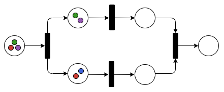

# DistributedWorkflow.jl - A Julia interface to a distributed task-based workflow management system



[](https://github.com/FiroozehDastur/DistributedWorkflow.jl/actions/workflows/CI.yml)
[](https://codecov.io/gh/FiroozehDastur/DistributedWorkflow.jl)
[](http://bjack205.github.io/DistributedWorkflow.jl/dev)


## How to cite DistributedWorkflow.jl

Please cite this package as follows if you use it in your work:

```
@misc{DistributedWorkflow,
  author    = {Dastur, Firoozeh and Zeyen, Max and Rahn, Mirko},
  title     = {DistributedWorkflow.jl - A Julia interface to a distributed 
               task-based workflow management system},
  year     = {2024},
  month    = {January},
  howpublished     = {\url{https://github.com/FiroozehDastur/DistributedWorkflow.jl}}
}
```

## Initial setup

1. DistributedWorkflow.jl requires the package manager Spack to install necessary binaries. Follow the steps from [Spack - Getting Started](https://spack.readthedocs.io/en/latest/getting_started.html) to install Spack. You might also want to read [Spack - Basic Usage](https://spack.readthedocs.io/en/latest/basic_usage.html) to learn basic usage of Spack.

   > ---
   > **Note:**
   >
   > If you already have Spack installed and sourced in your path, then you may skip the above step.
   >
   > ---

2. Next, download the respective binary for your system from the following: [Binaries for DistributedWorkflow.jl](https://github.com/FiroozehDastur/DistributedWorkflow.jl/releases/tag/v0.1.0-se)

   *OR* 

   Download the binary file specific to your operating system from one of the links below:

   > ---
   > **Note:**
   >
   > The binaries are all built for the `x86_64_v3` architechture
   >
   > ---

   * [Ubuntu 22.04](https://github.com/FiroozehDastur/DistributedWorkflow.jl/releases/download/v0.1.0-se/distributedworkflow_ubuntu22)
   * [Debian 11](https://github.com/FiroozehDastur/DistributedWorkflow.jl/releases/download/v0.1.0-se/distributedworkflow_debian11)
   * [Debian 12](https://github.com/FiroozehDastur/DistributedWorkflow.jl/releases/download/v0.1.0-se/distributedworkflow_debian12)
   * [Rocky Linux 8](https://github.com/FiroozehDastur/DistributedWorkflow.jl/releases/download/v0.1.0-se/distributedworkflow_rockylinux8)
   * [Rocky Linux 9](https://github.com/FiroozehDastur/DistributedWorkflow.jl/releases/download/v0.1.0-se/distributedworkflow_rockylinux9)

3. Once the installation is complete, navigate to the directory where you saved your binary file and install it in a target location of your choice as follows:

   ```
   ./distributedworkflow_myOS --target zeda
   ```

   > ---
   > **Note:**
   >
   > Replace `myOs` with the specific name of the Linux distribution from the downloaded binary. For example, if you downloaded the binary file for Ubuntu 22, then you can run `./distributedworkflow_ubuntu22 --target zeda`.
   >
   > ---

   > ---
   > **Note:**
   >
   > You are free to choose any other target location besides `zeda`.
   >
   > ---

4. If the installation was successful, then running the following should load the required dependencies of `DistributedWorkflow.jl`.

   ```bash
   spack load distributedworkflow
   ```

   You can check the loaded packages by running:

   ```
   spack find --loaded
   ```

5. If you would like to visualise the workflows before compilation, it is advised to download [Graphviz](https://graphviz.org/download/) to be able to visualise it in different formats.

6. Now, we are set up to use DistributedWorkflow.jl to parallelise our application.

## DistributedWorkflow.jl

Once this package is registered at it can be installed similar to any Julia package by doing:

```julia
import Pkg; Pkg.add("DistributedWorkflow")
```

For now, doing the following should work:

1. Once you have the Julia REPL open, enter the package mode of julia and add the github repo as follows:

   ```julia
   ] add https://github.com/FiroozehDastur/DistributedWorkflow.jl.git
   ```

2. Once the package administrator has installed `DistributedWorkflow`, it can be loaded like any other Julia package by running `using DistributedWorkflow` in the Julia REPL.

## How to use DistributedWorkflow.jl

To use `DistributedWorkflow` to parallelise an application, the following steps are required:

1. Setting up your Julia application structure. <!-- that will be run in parallel. This can be a single `.jl` file with all the necessary methods, or multiple `.jl` files. -->
2. Designing a workflow in the form of a Petri net.
3. A serializer descriptor. If you are using Julia's default serializer then you can skip this step.
4. Setting up the workflow launcher.
5. Compile and execute.

### A Simple Example

With the following example, we demonstrate the usage with a simple "Hello World" example.

Assuming that we use Julia's native serializer, let's say we have the following Julia code to run:

```julia
function hello_julia(In1, In2)
  a1 = In1 * 2;
  a2 = In2 - 3;
  str = ["if you are reading this, then your application worked..."]
  arr = [a1, a2]
  g = gcd(arr)
  ar = [(In1, In2, a1, a2, g)]
  return [str, ar]
end
```

It could be stored in a file, say `hello.jl`. Based on this piece of code we can see that the workflow is a Petri net with 2 input places, 1 transition, and 2 output places.

The Petri net can now be constructed as follows:

```julia
# A Petri net with 2 input places and 2 output places

# create an empty Petri net called "hello_julia"
pn = PetriNet("hello_julia") 

# create the input and output places
p1 = place("input_file1") 
p2 = place("input_file2")
p3 = place("output_file1")
p4 = place("output_file2")

# add a transition
t = transition("hello_jl")

# connect all the places and transitions based on their connection type to the Petri net
connect(pn,[(p1, :in),(p2, :in),(p3, :out), (p4, :out)], t)

# Alternatively, each place and transition can be connected individually, as shown below:
#
# connect(pn, p1, :in)
# connect(pn, p2, :in)
# connect(pn, p3, :out)
# connect(pn, p4, :out)

# generate the workflow in the folder "tmp" under the home directory.
wf = generate_workflow(pn)
```

To visualise the workflow before generating the XML format of it, run `view_workflow(pn)`. This would generate the following image as a PNG in a default location.


To visualise the workflow in one of the other formats and a specific path use `view_workflow(pnet::PetriNet, format::Symbol, path::String)`. For example, `view_workflow(pn, :svg, "home/usr/zeda/net")` generates an SVG of the above Petri net and stores it in the path `home/usr/zeda/net`.

> ---
> **Warning:**
>
> The renderer works best if you have graphviz installed on your system. For Ubuntu 22 you can do `apt install graphviz` to install it.
>
> ---

> ---
> **Note:**
>
> The number of transitions coincide with the number of Julia methods to execute. Each input/output token corresponds to a string containing the file name where data is stored.
>
> ---

***CONTINUE HERE***

### Testing the example locally
<!-- 1. write your Julia application to be executed in parallel -->
<!-- 2. create a Petri net with respect to the Julia code. This will be your workflow and the code will be linked and executed based on this Petri net. -->
<!-- 3. Before compiling the net, you can view it in a format of your choice as follows: -->
<!-- 4. Compile the workflow: -->
<!-- 5. Once the workflow is compiled successfully, we are ready to test it locally as follows: -->
<!-- Start the client -->
<!-- link the ports -->
<!-- submit workflow -->
<!-- your results will be stored in the following path if a path is not specified by you: -->

<!-- What to do if you have a custom serialiser??? -->
<!-- Follow the example below for using a custom Serialiser. For demonstration purposes we use hdf5, something else, and Oscar's specific serialiser. Link Oscar here as a Computer algebra system. -->

Assuming that you have a workflow Petri net stored in an accessible location, use the following function to compile the workflow:

```julia
compile_workflow(<workflow-name>.xpnet, "/path/to/build/location")
```

Next, start the client using

```julia
client(<number-of-workers>, "/path/to/nodefile", "rif-strategy")
```

As a next step, it is advisible to create a script with your workflow configuration (see the executor files in the examples folder), and submit your application using the ```submit_workflow()``` function.

Once your application runs through, the output files will be stored in your desired output location.

### Running the example on a cluster

> NOTE: for more examples see: [examples](examples). For examples related to different (complex) Petri nets and its features see [GPI-Space database on Petri nets.](https://github.com/cc-hpc-itwm/gpispace/tree/v23.06/share/doc/example)

## API Functions

**The following is a list of API functions related to generating and viewing a workflow in the form of Petri nets:**

| Function | Usage |
|:-:|:-:|
| [arc(place::Place, transition::Transition, arc_type::Symbol)]() | Creates an object of type Arc that joins a place to a transition in a Petri net.|
| [connect(pnet::PetriNet, place::Place, transition::Transition, arc_type::Symbol)]() | Given a Petri net connects the place to the transition with the given arc type.|
| [PetriNet(workflow_name::String)]() | Creates an empty Petri net named: "workflow_name". Throws an error, if workflow name is not provided.|
| [place(name::String, type::Symbol)]() | Creates an object of type Place for the Petri net object.|
| [port(type::Symbol, place::Place)]() | Creates a port connecting to the given place with respect to the arc type.|
| [transition(name::String, condition::String)]() | Creates an object of type Transition for the Petri net object. If a condition string is given, the the transition is a condiational transition.|
| [remove(pnet::PetriNet, place::Place)]() | Remove the place from the given Petri net.|
| [workflow_generator(pnet::PetriNet, path::String)]() | Given a Petri net description, creates an XML workflow and writes it to a file in the path.|
| [view_workflow(pnet::PetriNet, format::Symbol, path::String)](./src/workflow_renderer.jl#L6) | Generates a file in one of the acceptable formats after compiling the Petri net into an XML workflow and compiling the workflow. If path is not given then the workflow image is stored in the home directory in the "tmp/pnet" folder.|

**The following is a list of API functions for setting the application and workflow configuration:**

| Function | Usage |
|:-:|:-:|
| [application_config()]() | Description of function here...|
| [client()]() | Description of function here...|
| [compile_workflow(workflow::String, build_dir::String)]() | Given a path for the workflow and an accessible location for the build directory, this function compiles the XML workflow.|
| [function_name()]() | Description of function here...|
| [implementation()]() | Description of function here...|
| [input_pair()]() | Description of function here...|
| [julia_implementation()]() | Description of function here...|
| [output_dir()]() | Description of function here...|
| [port_info()]() | Description of function here...|
| [set_workflow_env()]() | Description of function here...|
| [submit_workflow()]() | Description of function here...|
| [workflow_config()]() | Description of function here...|

## Features

* Serializer agnostic, for details see [custom serialize](docs/src/Serialization/custom_serializer.md) section in the documentation.
* Reduced complexity in deploying your parallel application.
* Localised testing of workflow, before launching expensive cluster resources.
* Write your own `xpnet` file and compile your workflow using the `compile_workflow()` function. 
* You could also, generate a Petri net in Julia using `PetriNet()` and generate the `xpnet` file from the Petri net using `workflow_generator()` before compiling it.
* Visualise Petri net within the Julia REPL in multiple formats.

## Shortcomings

* At the moment, this package is only efficient and recommended for long running processes.
* Due to the underlying workflow manager, this package only supports the following operating systems:

  ```
  * Ubuntu 20.04 LTS
  * Ubuntu 22.04 LTS
  ```
  However, we have provided binaries to some additional distributions that we are testing against. In case of any problems related to installation or setup, please get in touch with us.

## See also

* [More Examples]( ./examples)
* [XPNET Format Schema](https://github.com/cc-hpc-itwm/gpispace/blob/v23.06/share/xml/xsd/pnet.xsd)
* [GPI-Space database on Petri nets](https://github.com/cc-hpc-itwm/gpispace/tree/v23.06/share/doc/example)

## ToDo...

* Add examples for a cluster run.
* Improve UI by adding documentation and examples.
* Extend the interface to add more features.

## Appendix

The underlying workflow management system is called [GPI-Space](https://www.gpi-space.de/) which is a task-based workflow management system for parallel applications developed at Fraunhofer ITWM by the CC-HPC group.

## Package Dependencies

* [Cairo](https://github.com/JuliaGraphics/Cairo.jl)
* [CxxWrap](https://docs.juliahub.com/General/CxxWrap/stable/)
* [FileIO](https://juliaio.github.io/FileIO.jl/stable/)
* [GraphViz](https://graphviz.org/)
* [GPI-Space](https://www.gpi-space.de/)
* [LightXML](https://juliapackages.com/p/lightxml)
* [Markdown](https://docs.julialang.org/en/v1/stdlib/Markdown/)
* [Serialization](https://docs.julialang.org/en/v1/stdlib/Serialization/)

* [TOML](https://docs.julialang.org/en/v1/stdlib/TOML/)
